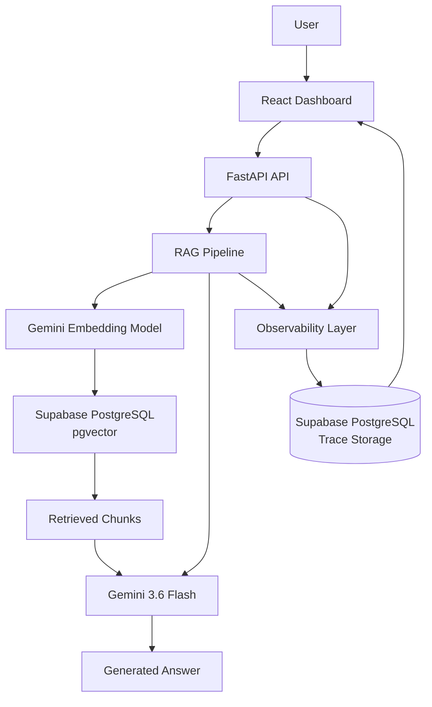

# RAG Observability Platform

An observability dashboard for a Retrieval-Augmented Generation (RAG) application.

When an LLM application is slow or fails, the response time alone does not tell you where the problem occurred. The delay could come from generating embeddings, querying the vector database, retrieving context, or generating the final response.

This project instruments those stages and stores the resulting traces so that the performance and reliability of the RAG pipeline can be inspected from one dashboard.

## What it tracks

For each RAG request, the platform records:

* Embedding latency
* Vector search latency
* Retrieval latency
* LLM latency
* End-to-end request latency
* Input, output, thought, and total token usage
* Request status
* Failure stage
* Error details

The dashboard provides an overview of application health, latency, failures, token usage, and individual request traces.

## Architecture



## How it works

A user submits a question through the dashboard.

The FastAPI backend sends the question through the RAG pipeline:

1. The question is converted into an embedding.
2. The embedding is used to search the PostgreSQL vector database.
3. The most relevant document chunks are retrieved.
4. The retrieved context is provided to Gemini.
5. Gemini generates the final answer.
6. The observability layer records the timing, token usage, request status, and any failure information.
7. The trace is stored in PostgreSQL and can be viewed from the dashboard.

This makes it possible to distinguish between different sources of latency instead of treating the entire request as one measurement.

## Dashboard

The dashboard currently provides:

### Overview

High-level metrics for the application, including:

* Total requests
* Successful requests
* Failed requests
* Error rate
* Average request latency
* Average retrieval latency
* Average LLM latency
* Total token usage

### Latency Analysis

A comparison of retrieval and LLM latency across recent successful requests.

This helps show whether time is being spent primarily in the retrieval stage or during generation.

### Failure Analysis

Failed requests are grouped by failure stage, such as:

* Embedding
* Vector search
* LLM
* Unknown

### Recent Traces

The dashboard displays recent requests with their:

* Timestamp
* Question
* Status
* Retrieval latency
* LLM latency
* Total latency
* Token usage

Individual traces can be opened to inspect their details.

## Tech Stack

**Backend**

* Python
* FastAPI
* SQLAlchemy
* Google Gemini API

**RAG**

* Gemini Embeddings
* PostgreSQL
* pgvector

**Database**

* Supabase PostgreSQL

**Frontend**

* React
* TypeScript
* Vite
* Recharts

## Project Structure

```text
llm-observability/
├── backend/
│   ├── app/
│   │   ├── main.py
│   │   ├── llm.py
│   │   ├── database.py
│   │   ├── models.py
│   │   └── rag.py
│   ├── documents/
│   │   └── sample.txt
│   ├── init_db.py
│   └── requirements.txt
│
├── frontend/
│   ├── src/
│   ├── public/
│   ├── package.json
│   └── vite.config.ts
│
├── .gitignore
└── README.md
```

## Running Locally

### 1. Clone the repository

```bash
git clone https://github.com/PersieB/llm-observability.git
cd llm-observability
```

### 2. Set up the backend

Create and activate a virtual environment:

```bash
cd backend

python -m venv .venv
```

On Windows:

```bash
.venv\Scripts\activate
```

Install the dependencies:

```bash
pip install -r requirements.txt
```

Create a `.env` file in the `backend` directory:

```env
GEMINI_API_KEY=your_gemini_api_key
DATABASE_URL=your_supabase_database_url
```

Initialize the database:

```bash
python init_db.py
```

Start the FastAPI server:

```bash
python -m uvicorn app.main:app --reload
```

The API will be available at:

```text
http://127.0.0.1:8000
```

FastAPI's interactive API documentation is available at:

```text
http://127.0.0.1:8000/docs
```

### 3. Set up the frontend

Open another terminal:

```bash
cd frontend
npm install
```

Create a `.env` file:

```env
VITE_API_URL=http://127.0.0.1:8000
```

Start the development server:

```bash
npm run dev
```

The dashboard will be available at:

```text
http://localhost:5173
```

## Example RAG Flow

A request such as:

```text
What is Retrieval-Augmented Generation?
```

passes through the following stages:

```text
Question
   │
   ▼
Generate Embedding
   │
   ▼
Vector Search
   │
   ▼
Retrieve Relevant Chunks
   │
   ▼
Build Context
   │
   ▼
Gemini
   │
   ▼
Answer
```

At the same time, the observability layer measures the individual stages and stores the resulting trace.

## Why I Built This

A single latency number is often not enough to understand an LLM application's performance.

For a RAG system, the request passes through multiple components before the user receives an answer. Instrumenting those stages makes it possible to ask more useful questions:

* Is retrieval becoming a bottleneck?
* Is vector search taking longer than expected?
* How much time does generation contribute to the request?
* How many tokens are being consumed?
* Where are failures occurring?
* How does the end-to-end latency compare with the individual pipeline stages?

The project was built to explore these questions through a small, focused observability system rather than relying on a third-party observability platform.

## Current Scope

This project focuses on request-level observability for a RAG pipeline.

It does not attempt to provide a complete production observability platform. Features such as authentication, distributed tracing, background telemetry queues, alerting, deployment infrastructure, and large-scale traffic management are intentionally outside the current scope.

## Future Research Direction

One direction I am interested in exploring is the trade-off between **observability overhead and reliability**.

For example, telemetry can be written synchronously during a request, which makes trace persistence straightforward but can add latency. It can also be written asynchronously or in the background, potentially reducing request overhead but introducing the possibility of delayed or lost traces.

A future experiment could compare these approaches by measuring:

* Added request latency
* Trace-write latency
* Throughput
* Trace loss
* Reliability under increasing request loads

This would help quantify how the design of an observability layer affects the application it is intended to monitor.
